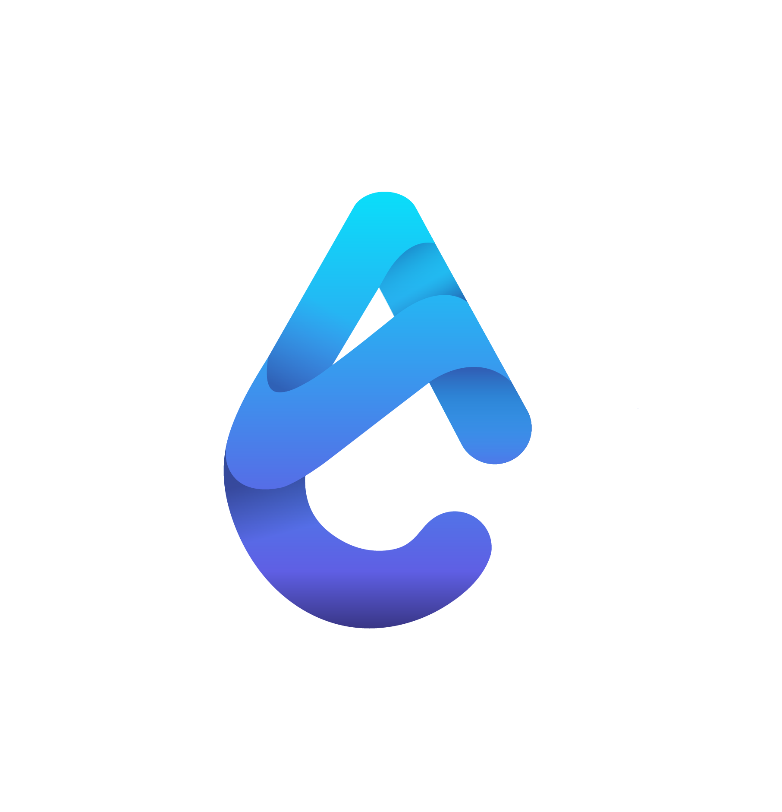

<!-- markdownlint-disable MD033 -->

<h1 align="center">Kratos's GitHub Profile</h1>

Web3 BUIDLR with a passion for all things DeFi.

## &nbsp; **Major Projects**

### Argo Protocol - Liquid Staking on Cronos (Undergoing Certik Audit)

Co-Founder and Lead Smart Contract Developer for Argo.  
Planned out architecture according to business requirements. Developed smart contracts for all core features of Argo.

## &nbsp; **Minor Projects**

**TO BE UPDATED**

## 🔧 &nbsp;**Current Tech Stack**

## 🧰 &nbsp;**Unused Tech**

